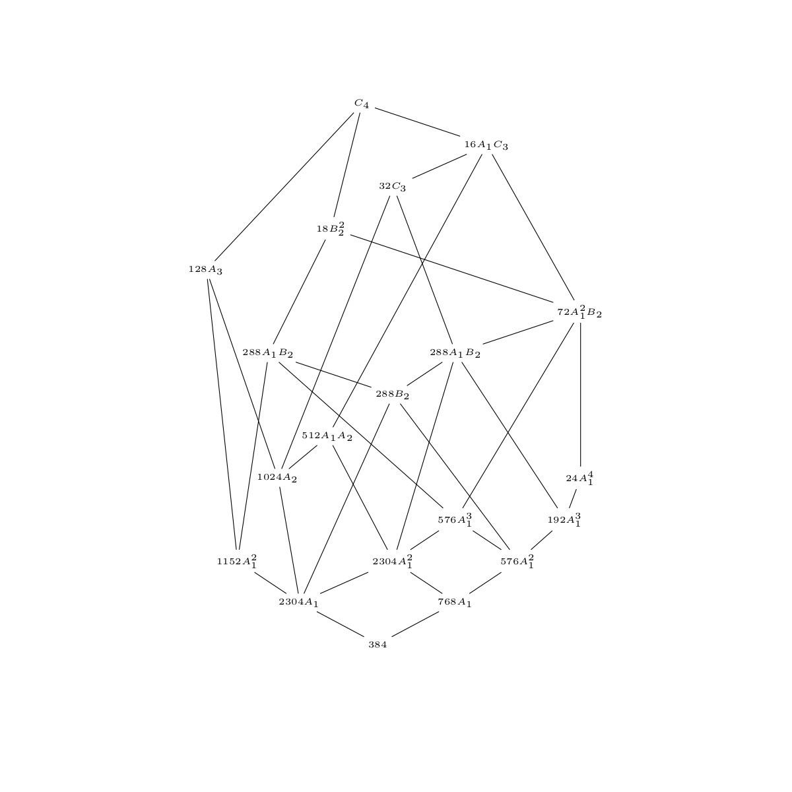
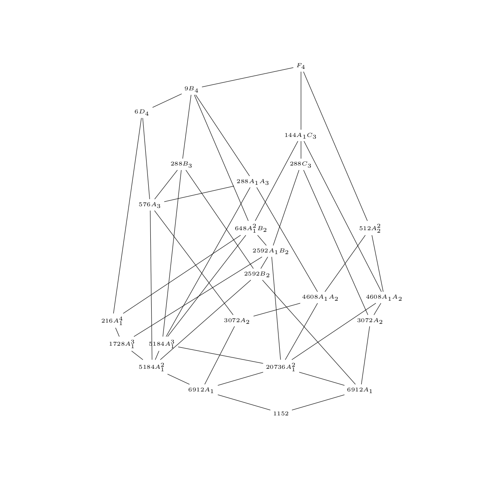

# LiePy

A python package for computations in Lie theory.

There are three main classes:

* RootSystem
* DynkinDiagram
* CartanMatrix

And there are functions to go from one to the other.

This was originally created to do computations for [this paper](https://doi.org/10.1007/s00031-018-9501-x) (see Section 6). [[arxiv link](https://arxiv.org/abs/1709.09126)]

## Examples

For example, the following snippet prints the LaTeX code for the Hasse diagram of the poset of root subsystems of the symplectic Lie algebra sp(8, C) (i.e. type C4)
```python
import liepy

# Create Dynkin diagram object for the Lie algebra sp(8, C)
dynkin = liepy.DynkinDiagram('C4')

# Create the corresponding root system
rootsystem = liepy.RootSystem(dynkin)

# Compute the poset of root subsystems.
poset = rootsystem.poset_subsystems()

# Output the LaTeX code
poset.latex_hasse()
```
Which gives



Similarly, we can do this for the exceptional Lie algebra F4, which gives:



See the [paper](https://doi.org/10.1007/s00031-018-9501-x) for more examples.
